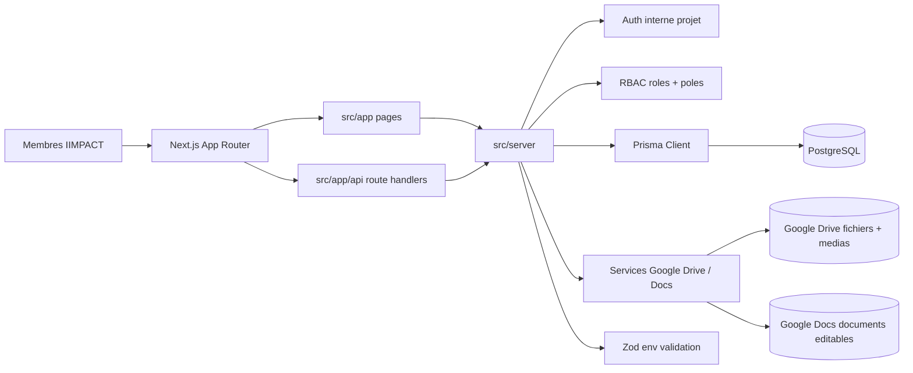
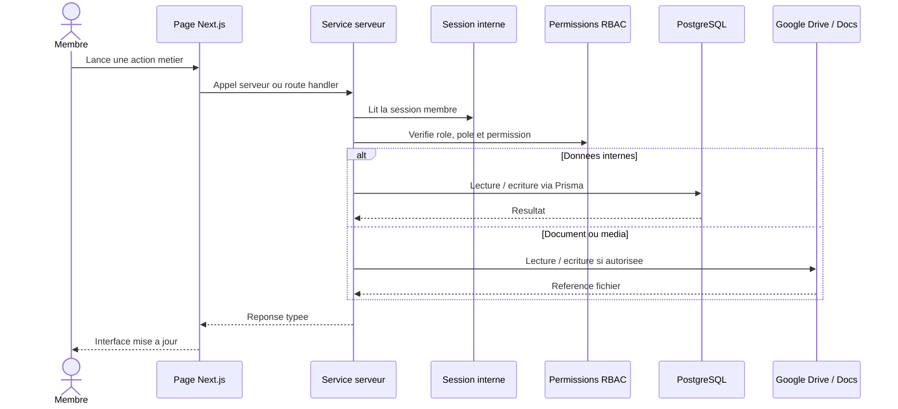
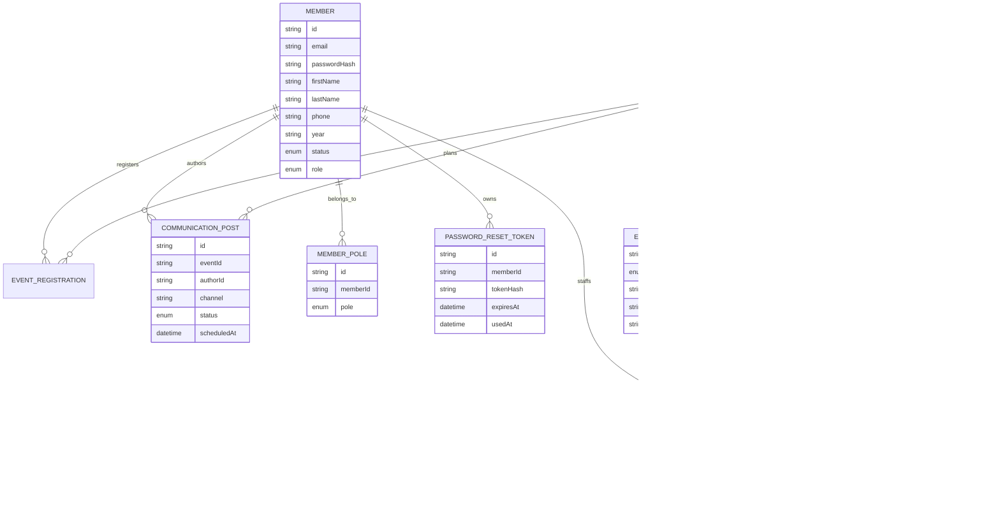
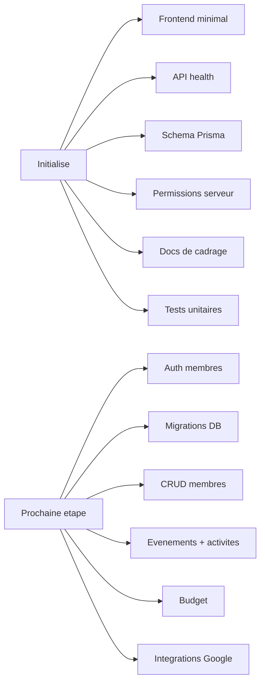

# Schema du projet

Ce document donne une vue d'ensemble du socle initialise.

## Vue technique globale



## Flux d'une action protegee



## Domaines fonctionnels

```mermaid
flowchart TB
  App[IIMPACT Gestion Association]

  App --> Members[Membres]
  App --> Events[Evenements]
  App --> Budget[Budget]
  App --> Communication[Communication]
  App --> Inventory[Inventaire]
  App --> Documents[Documents]

  Members --> Roles[Roles]
  Members --> Poles[Poles]
  Members --> Leads[Responsables de pole]

  Events --> Internal[Evenements internes]
  Events --> External[Evenements externes]
  Events --> Activities[Activites]
  Events --> Staff[Staff]
  Events --> Registrations[Inscriptions]

  Budget --> Revenues[Recettes]
  Budget --> Expenses[Depenses]
  Budget --> Forecasts[Previsions]
  Budget --> History[Historique]

  Communication --> Calendar[Calendrier editorial]
  Communication --> Posts[Publications]
  Communication --> Tracking[Suivi d'avancement]

  Inventory --> Items[Materiel]
  Inventory --> Stocks[Stocks]
  Inventory --> Orders[Commandes]

  Documents --> Drive[Google Drive]
  Documents --> Docs[Google Docs]
```



## Modele de donnees initial



## Organisation des fichiers

```text
gestion_asso/
├── Projet.md
├── README.md
├── .env.example
├── package.json
├── next.config.ts
├── prisma.config.ts
├── prisma/
│   └── schema.prisma
├── docs/
│   ├── architecture.md
│   ├── data-model.md
│   ├── development-roadmap.md
│   ├── integrations-google.md
│   ├── permissions.md
│   └── project-schema.md
├── src/
│   ├── app/
│   │   ├── page.tsx
│   │   ├── layout.tsx
│   │   ├── membres/page.tsx
│   │   └── api/health/route.ts
│   ├── features/members/
│   │   ├── member-demo-data.ts
│   │   ├── member-rules.ts
│   │   ├── member-schemas.ts
│   │   ├── member-service.ts
│   │   └── members-client.tsx
│   ├── lib/
│   │   └── utils.ts
│   └── server/
│       ├── auth/session.ts
│       ├── db/client.ts
│       ├── env.ts
│       ├── permissions.ts
│       └── permissions.test.ts
└── e2e/
    └── home.spec.ts
```

## Etat actuel


